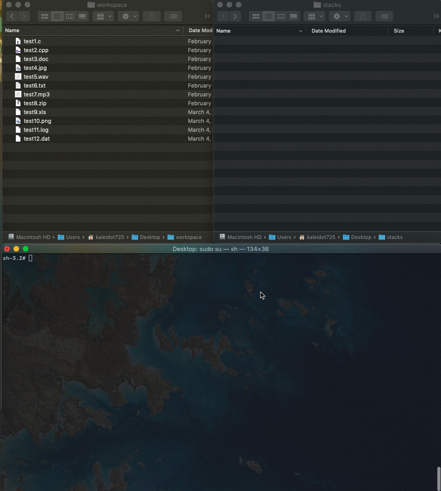

# Suezo 

Suezo is a tool to forced stacks

Usage :  
     suezo -src <source> -dst <destination> [options]  

The options are  
     -delete       delete source directories.  
     -help          display help message.  
     -version     display versfion message.  

